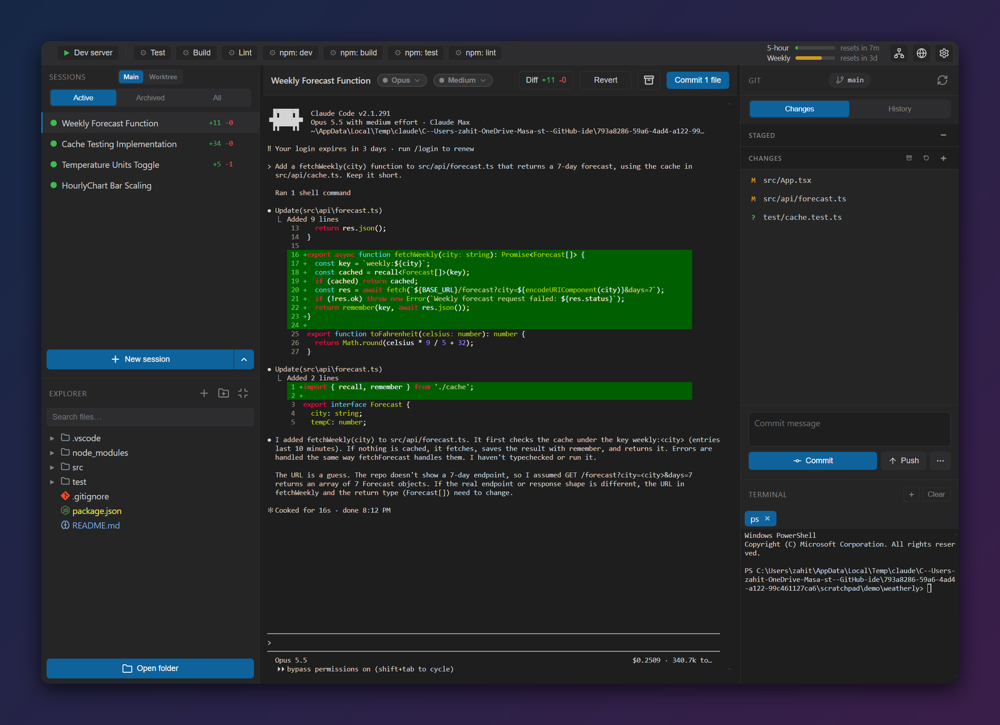
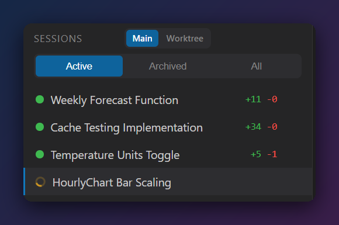
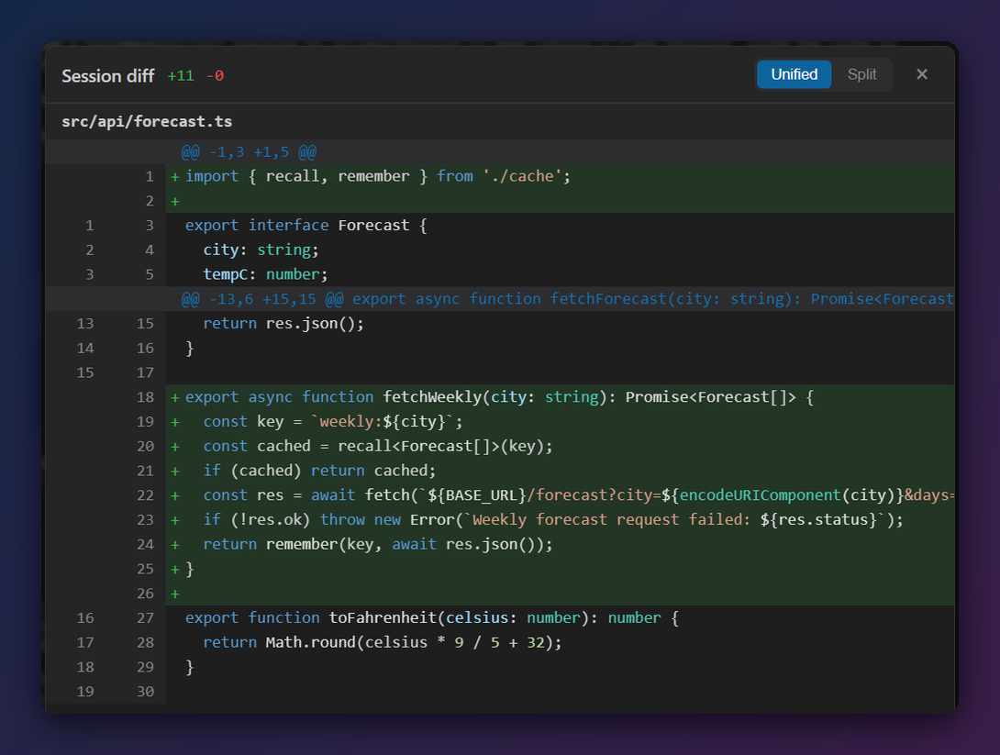

<div align="center">

<picture>
  <source media="(prefers-color-scheme: dark)" srcset="docs/images/banner-dark.svg">
  <source media="(prefers-color-scheme: light)" srcset="docs/images/banner-light.svg">
  
</picture>

<br/>

**A desktop cockpit for agentic coding.** Run a dozen Claude Code (or Codex) sessions at once,<br/>
see which one needs you at a glance, and commit each session's work on its own.

<br/>

[](https://github.com/zahiterdemguzel/ide/releases/tag/latest)


[](LICENSE)

[Features](#-features) · [Download](#-download) · [Run from source](#-run-from-source) · [Mobile companion](#-mobile-companion) · [Contributing](#-contributing)

</div>

<br/>

<p align="center">
  
</p>

## Why

A single Claude Code session is great. **Five at once** is where it gets messy: terminals pile up, you lose track of which agent is waiting on a permission prompt, and their edits all land in one working tree, so committing one task means untangling another's.

IDE is built for that workflow. Each session is a real `claude` CLI in its own terminal. A colored dot tells you what it's doing, and the app tracks every file each agent touched, so you can **diff, revert or commit one session's work without touching the others**.

## ✨ Features

### 🟢 Status at a glance



Every session gets a live status dot, driven by Claude Code's own hooks rather than by scraping the terminal.

| | State |
|:-:|---|
| 🟡 | **Working** (animated spinner) |
| 🟢 | **Needs input** or **done** |
| 🟣 | **Committed / pushed** |
| 🔴 | **Interrupted** |
| ⚪ | **Idle** |

A chime and a desktop notification fire when a session finishes, so you can look away. Sessions get short auto-generated names and show their running `+added −removed` line counts. Archive a session to free its resources and restore it later: the conversation resumes where it left off.

<br clear="right"/>

### 🧩 Per-session git
- **Diff, revert or commit one session's work.** The app records every edit each agent makes, so *Commit* stages only that session's hunks, even when several sessions edited the same file.
- **Worktree mode:** flip one toggle and every new session gets its own git worktree and branch, so agents can build and test in parallel without stepping on each other. *Merge* brings the work back.
- **A full git pane:** stage, commit, amend, undo, push, pull, stash, branches, history, conflicts, and GitHub PRs via `gh`. Leave the commit message empty and one is written for you, using a local model if you have one installed, otherwise Claude Haiku.
- **Hand a merge to Claude:** when a pull or push needs a merge, one click opens a session to resolve it.

<p align="center">
  
</p>

### 🛠️ A real workspace around your agents
- **Run toolbar:** one button per `.vscode/launch.json` config and `tasks.json` task (plus every npm script), with VS Code variables, inputs, compounds and pre-launch tasks resolved for you.
- **Explorer, Quick Open (`Ctrl+P`) and Command Palette**, plus a built-in editor with syntax highlighting.
- **Viewers for almost anything:** images, 3D models (glTF/GLB), an SVG vector editor, PDF view and page editing, spreadsheets, and SQLite databases with inline editing and a SQL console.
- **Project diagram:** classes, dependencies, calls and inheritance, extracted with tree-sitter and laid out automatically.
- **Inline browser** with a Chrome-style console, for previewing what your agents built.

### 🧠 Models, your way
- Pick the **model and reasoning effort per session**, and switch either one on a live session.
- **OpenAI Codex CLI** sessions run side by side with Claude ones, with the same status dots and per-session commits.
- **Local models:** install open-source GGUF models (Llama, Qwen Coder, …) from Settings and run a session fully offline. RAM and VRAM fit warnings included.
- **Usage meter** for your Claude subscription's 5-hour and weekly limits, plus a per-session token and cost line.

### 🎙️ And more
- **Voice input:** dictate into the focused session with offline Whisper. Audio never leaves your machine.
- **Themes** (Dark, Light, Midnight, Solarized, …) and **5 languages** (English, Deutsch, Español, Français, Türkçe).
- A guided **first-run tour** and a setup wizard that installs and signs in to Claude Code for you.

## 📱 Mobile companion

Pair your phone by scanning a QR code (*Settings → Remote access*) and keep working away from your desk: chat with sessions, answer Claude's questions and permission prompts with a tap, stage/commit/push, browse and edit files, and browse the web through the desktop's own browser.

The app lives in [`mobile/`](mobile/) (Expo / React Native); see its [README](mobile/README.md).

## 📦 Download

Every push to `master` that includes `(build)` in the commit message produces fresh builds for all three platforms:

**[⬇️ Get the latest build](https://github.com/zahiterdemguzel/ide/releases/tag/latest)**

| Platform | File | Notes |
|---|---|---|
| Windows | `.exe` | Unsigned: SmartScreen may warn. Choose *More info → Run anyway*. |
| macOS | `.dmg` | Unsigned: right-click the app → *Open* the first time. |
| Linux | `.AppImage` | `chmod +x` it, then run. |

> [!IMPORTANT]
> IDE is a front-end for the [Claude Code CLI](https://docs.claude.com/en/docs/claude-code/overview). If it isn't installed, the app walks you through installing it and signing in on first launch.

## 🚀 Run from source

**Prerequisites**

- [Node.js](https://nodejs.org) **20+** (CI uses 22) and npm
- [Git](https://git-scm.com)
- [Claude Code](https://docs.claude.com/en/docs/claude-code/overview), installed and signed in (or let the app's setup wizard do it)
- *Optional:* [GitHub CLI `gh`](https://cli.github.com) for PRs and repo creation, and [Codex CLI](https://github.com/openai/codex) for Codex sessions

**Install and start**

```bash
git clone https://github.com/zahiterdemguzel/ide.git
cd ide
npm install      # also fetches the offline voice model and fixes the Electron signature on macOS
npm start
```

No native compile step and no bundler: the app is plain JavaScript loaded directly by Electron.

**Open a specific folder on launch**

```bash
npm start -- --folder /path/to/your/project
```

**Build a distributable**

```bash
npm run build         # Windows (unpacked app in dist/)
npm run build:mac     # macOS .dmg
npm run build:linux   # Linux .AppImage
```

<details>
<summary><b>All npm scripts</b></summary>

| Script | What it does |
|---|---|
| `npm start` | Launch the app |
| `npm test` | Unit tests (Node's built-in test runner, no extra deps) |
| `npm run lint` | ESLint over the whole tree |
| `npm run build` / `build:mac` / `build:linux` | Package with electron-builder |
| `npm run build:android` | Build the mobile companion APK (needs a JDK and the Android SDK) |
| `npm run fetch:stt` | Re-download the offline speech-to-text model |
| `npm run gen:mobile` | Regenerate the assets the mobile app shares with the desktop |

</details>

## 🏗️ How it works

```
renderer/  ──IPC (preload/)──►  main/  ──►  node-pty · git · hook server · llama.cpp
  (UI)                           (OS)
```

- Each session is a `claude` process in a [node-pty](https://github.com/microsoft/node-pty) terminal rendered by [xterm.js](https://xtermjs.org).
- The app passes Claude Code a `--settings` blob that registers **hooks** pointing at a local HTTP server. Those hook events drive the status dots and record each agent's edits. Your global Claude settings are never touched.
- Git is plain `git` porcelain: no git library, no surprises.
- The renderer has no Node access. Everything that touches the OS goes over a typed IPC surface in `src/preload/`.

Deeper docs live in [`.claude/memory/`](.claude/memory/MEMORY.md). Start at the [architecture map](.claude/memory/architecture.md#map--start-here).

## 🤝 Contributing

Issues and pull requests are welcome!

1. Fork the repo and create a branch.
2. Keep pure logic in Electron-free modules so it stays testable, and add or update a test in `test/`.
3. Run `npm test` and `npm run lint`: both must pass.
4. If you change behavior, update the matching doc in `.claude/memory/`.

See [`CLAUDE.md`](CLAUDE.md) for the full coding conventions (they apply to humans too).

## 📄 License

[GNU Affero General Public License v3.0](LICENSE). You may use, modify and share IDE, but modified versions you distribute, or run for others over a network, must be released under the same license with their source code.

<div align="center">
<sub>Built with ❤️ for people who have too many terminals open.</sub>
</div>
